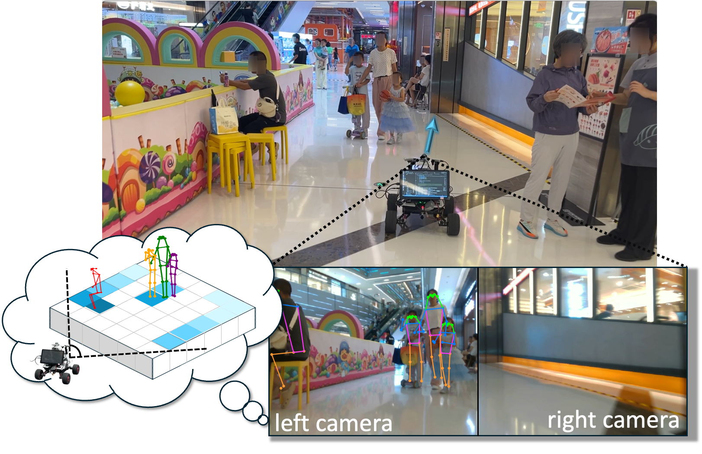
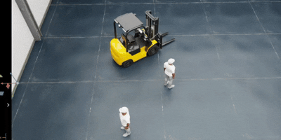

# iCrowdNav

> <b>Learning Robot Visual Navigation in Crowds via Intention-Aware Scene Representations</b>  
> Han Bao*, Bingyi Xia*, Hanjing Ye,  Yu Zhan,  Hao Cheng,  Baozhi Jia,  Wenjun Xu,  Jiankun Wang  
> RA-L 2026 
> [<u>site</u>](https://broln7.github.io/socialbev.io/), [<u>video</u>](https://www.youtube.com/watch?v=8q0dhAiWCEA&feature=youtu.be)

<table>
  <tr>
    <td></td>
    <td></td>
  </tr>
  <tr>
    <td></td>
    <td></td>
  </tr>
</table>

  
  
  
  
  

## TODO

- [ ] Release codes of iCrowdNav.