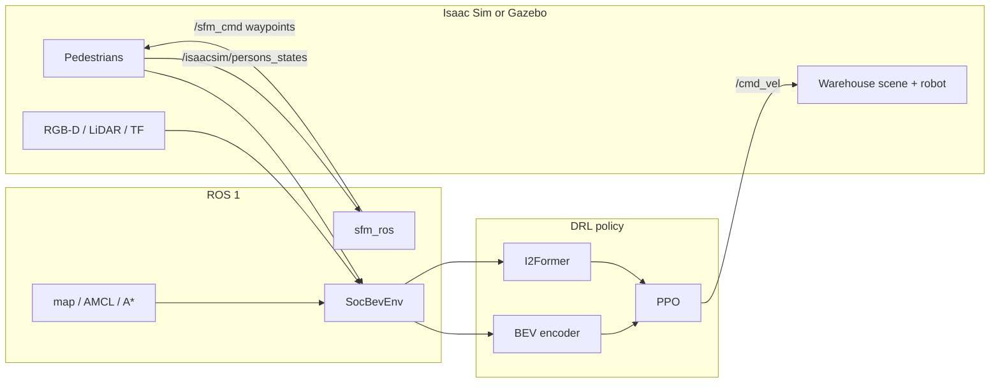

# iCrowdNav

> <b>Learning Robot Visual Navigation in Crowds via Intention-Aware Scene Representations</b> <br>
> Han Bao*, Bingyi Xia*, Hanjing Ye, Yu Zhan, Hao Cheng, Baozhi Jia, Wenjun Xu, Jiankun Wang <br>
> IEEE Robotics and Automation Letters (RA-L), 2026<br>
> [<u>project page</u>](https://broln7.github.io/socialbev.io/), [<u>video</u>](https://www.youtube.com/watch?v=8q0dhAiWCEA&feature=youtu.be), [<u>paper</u>](https://doi.org/10.1109/LRA.2026.3677748)

<table style="width: 80%; margin: 0 auto; text-align: center;">
  <tr>
    <td>
      <div style="margin: 0;">
        
        <div style="margin-top: 5px;">iCrowdNav</div>
      </div>
    </td>
    <td>
      <div style="margin: 0;">
        
        <div style="margin-top: 5px;">Social Force Model</div>
      </div>
    </td>
  </tr>
  <tr>
    <td>
      <div style="margin: 0;">
        
        <div style="margin-top: 5px;">Simulation Evaluation</div>
      </div>
    </td>
    <td>
      <div style="margin: 0;">
        
        <div style="margin-top: 5px;">Real-world Deployment</div>
      </div>
    </td>
  </tr>
</table>

<p align="center">
  
  
  
  
  
  
</p>

## Abstract

Robot crowd navigation requires the ability to infer human intentions while accounting for the structural constraints of the environment. Currently, deep reinforcement learning (DRL) provides a promising method for learning navigation policies that understand human intentions. However, most of them rely on limited scene representations, treating pedestrians as simple 2D points and ignoring rich visual cues from both humans and the environment. To address this issue, **iCrowdNav**, a novel visual crowd navigation method with intention-aware scene representations, is introduced to encode behavioral and structural context from egocentric visual observations. Our method employs two key components: a spatio-temporal encoder for extracting occupancy features of the scene, and Intent-Interact Former (I²Former), an attention-based module that encodes human poses to infer pedestrians’ motion intentions. These features are integrated into a compact state embedding that supports effective DRL policy training. Extensive experiments show that our method achieves superior performance over baselines, and realworld deployment demonstrates vision-based crowd navigation.

## Simulation Assets

NVIDIA Omniverse and Nucleus are no longer provided as a joint distribution channel for the Isaac Sim content we used in the paper. The warehouse / office / hospital USD scenes were built on those Nucleus assets, so **we cannot ship the original simulation worlds in this repository**.

This release keeps a single **warehouse** example (`scene_ros/src/warehouse_ros.py`) as a template. You need to bring your own simulator scene.

**Isaac Sim.** We recommend **Isaac Sim 4.0**. Follow the official Isaac Sim [ROS Navigation](https://docs.isaacsim.omniverse.nvidia.com/4.2.0/ros_tutorials/tutorial_ros_navigation.html) tutorial and build a USD that already has ROS navigation (robot, occupancy map, TF, `/cmd_vel`). Then add a **stereo RGB-D camera** (left/right RGB + depth) so the policy can subscribe to `/rgb_left`, `/rgb_right`, `/depth_left`, and `/depth_right`. Point the warehouse launcher at that file:

```bash
export ICROWDNAV_USD=/path/to/your_ros_navigation.usd
export ICROWDNAV_ROBOT_PRIM=/World/layout/dingo   # change to your robot prim
```

Useful starting points in the Isaac Sim docs:

- ROS 1 Navigation: [Isaac Sim 4.2 ROS Navigation](https://docs.isaacsim.omniverse.nvidia.com/4.2.0/ros_tutorials/tutorial_ros_navigation.html)

Search for **ROS Navigation** in the Isaac Sim documentation matching your version if the links move.

**Gazebo (or any other ROS simulator).** Isaac Sim is not required. Any simulator is fine as long as it publishes / subscribes to the topics in [ROS Interface](#ros-interface). The policy and SFM nodes only talk to ROS.

## System Overview



- **[Pegasus Simulator](https://pegasussimulator.github.io/PegasusSimulator/)** (Isaac Sim plugin) spawns and animates pedestrians. Each pedestrian tracks a waypoint from the social-force node.
- **sfm_ros** computes Helbing-style social forces on the warehouse occupancy map and publishes `/sfm_cmd`.
- **drl_policy** wraps sensors as `SocBevEnv`, builds intention-aware features, and outputs discrete `(v, ω)` commands.

## Repository Structure

```text
icrowdnav/
├── README.md
├── requirements.txt
├── assets/                          # paper figures and demos
└── icrowdnav/                       # ROS catkin workspace
    └── src/
        ├── drl_policy/              # algorithm, gym env, PPO train / eval
        │   ├── config/default.yaml  # camera, BEV grid, env / reward
        │   ├── bev_perception/      # RGB-D → BEV + I2Former
        │   ├── socbev_gym/          # SocBevEnv only
        │   ├── mdp/
        │   ├── policy_train.py
        │   └── policy_inference.py
        ├── scene/
        │   ├── scene_ros/           # warehouse Isaac Sim launcher
        │   │   └── config/warehouse.yaml
        │   ├── PegasusSimulator/    # vendored Pegasus plugin
        │   ├── dingo_description/
        │   ├── dingo_2dnav/         # warehouse map, AMCL, A*
        │   ├── Astar/
        │   ├── pedsim_msgs/
        │   └── pedsim_transform/
        └── sfm-isaacsim/sfm_ros/    # warehouse social-force node
```

Gymnasium environment: `social-bev-v0` → `SocBevEnv`. Camera extrinsics, BEV bounds, and reward weights are in `drl_policy/config/default.yaml` (`ICROWDNAV_POLICY_CONFIG` to override). Pedestrian spawn poses and robot reset poses are in `scene_ros/config/warehouse.yaml` (`ICROWDNAV_SCENE_CONFIG` to override).

## Installation

Tested with **Ubuntu 20.04**, **ROS Noetic**, **Python 3.8**, **Isaac Sim 4.0.0**.

### 1. ROS workspace

```bash
git clone <this-repo> icrowdnav
cd icrowdnav/icrowdnav
catkin_make
source devel/setup.bash
export PYTHONPATH="$(rospack find drl_policy):${PYTHONPATH}"
```

### 2. Python dependencies

```bash
pip install -r requirements.txt
```

PyTorch must match your CUDA version. YOLO11 pose weights (`yolo11n-pose.pt`) are downloaded by Ultralytics on first run.

### 3. Simulator

See [Simulation Assets](#simulation-assets). For Isaac Sim, install Isaac Sim 4.0.0, enable the ROS 1 bridge, and add Pegasus from `icrowdnav/src/scene/PegasusSimulator/extensions`. For Gazebo, skip Isaac Sim / Pegasus and publish the same topics.

## Quick Start

Source ROS in every ROS terminal:

```bash
cd icrowdnav/icrowdnav
source devel/setup.bash
export PYTHONPATH="$(rospack find drl_policy):${PYTHONPATH}"
```

**1. ROS core**

```bash
roscore
```

**2. Simulator**

Isaac Sim (after you have a local USD):

```bash
export ICROWDNAV_USD=/path/to/your_ros_navigation.usd
ISAACSIM_PYTHON=<isaac-sim-4.0.0>/python.sh
$ISAACSIM_PYTHON src/scene/scene_ros/src/warehouse_ros.py
```

Or start Gazebo with the topics listed below.

**3. Map, localization, and social force**

```bash
roslaunch dingo_2dnav dingo_navigation.launch
```

**4. Policy training**

```bash
rosrun drl_policy policy_train.py
```

**5. Evaluation**

```bash
rosrun drl_policy policy_inference.py
```

By default, training writes to `~/drl_logdir/policy_training/`. Evaluation loads `--checkpoint` (default: `~/drl_logdir/policy_training/social-bev/rl_model_340000_steps.zip`). Trained weights are not shipped in this repository yet.

## ROS Interface

The policy does not depend on a particular USD or Gazebo world. Match these topics:

| Topic | Direction | Meaning |
| --- | --- | --- |
| `/rgb_left`, `/rgb_right` | Sim → policy | stereo RGB, 480×640 |
| `/depth_left`, `/depth_right` | Sim → policy | stereo depth, 480×640 |
| `/scan`, `/tf_pose`, `/odom`, `/map` | Sim / nav → policy | robot state |
| `/cmd_vel` | policy → Sim | velocity command |
| `/isaacsim/persons_states` | Sim → SFM / policy | pedestrian poses (`PoseArray`) |
| `/sfm_cmd` | SFM → Sim | pedestrian target waypoints |
| `/isaacsim/set_robot_state` | policy → Sim | reset robot pose |
| `/isaacsim/isaacsim_error` | Sim → policy | pose error after reset (needs compensation) |
| `/isaacsim_pose` | policy → SFM / AMCL | robot pose in map |

## Method Notes

- **BEV encoder.** Dual RGB-D (480×640) over 3 frames is encoded with ResNet-18, lifted with measured depth, and temporally warped into a robot-centric BEV occupancy feature.
- **I²Former.** YOLO11 estimates 17 body joints per camera; joints are back-projected to the robot frame. A pose transformer does joint self-attention and robot-to-pedestrian cross-attention.
- **Policy.** PPO (`stable-baselines3`) with a discrete action set: linear velocity `{0, 0.25, 0.5, 0.75, 1.0}` m/s × 21 angular-velocity bins.
- **Pedestrians.** Social-force control in ROS; in Isaac Sim this is executed through Pegasus `PersonController`.

## Acknowledgements

- [Pegasus Simulator](https://github.com/PegasusSimulator/PegasusSimulator) for the Isaac Sim people API.
- NVIDIA Isaac Sim and Omniverse.
- [stable-baselines3](https://github.com/DLR-RM/stable-baselines3) and [Ultralytics YOLO](https://github.com/ultralytics/ultralytics).

## License

This project is released under the [MIT License](LICENSE). Third-party components keep their original licenses (Pegasus Simulator is BSD-3-Clause; `pedsim_msgs` is BSD; Isaac Sim navigation packages remain NVIDIA copyright). Original Isaac Sim / Nucleus scene assets are **not** included.

## Citation

```
@ARTICLE{11456337,
        author={Bao, Han and Xia, Bingyi and Ye, Hanjing and Zhan, Yu and Cheng, Hao and Jia, Baozhi and Xu, Wenjun and Wang, Jiankun},
        journal={IEEE Robotics and Automation Letters},
        title={Learning Robot Visual Navigation in Crowds via Intention-Aware Scene Representations},
        year={2026},
        volume={11},
        number={5},
        pages={6186-6193},
        doi={10.1109/LRA.2026.3677748}}
```
